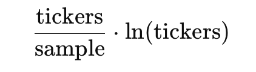
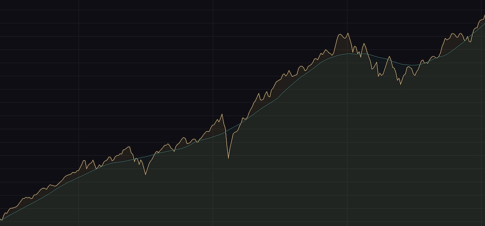
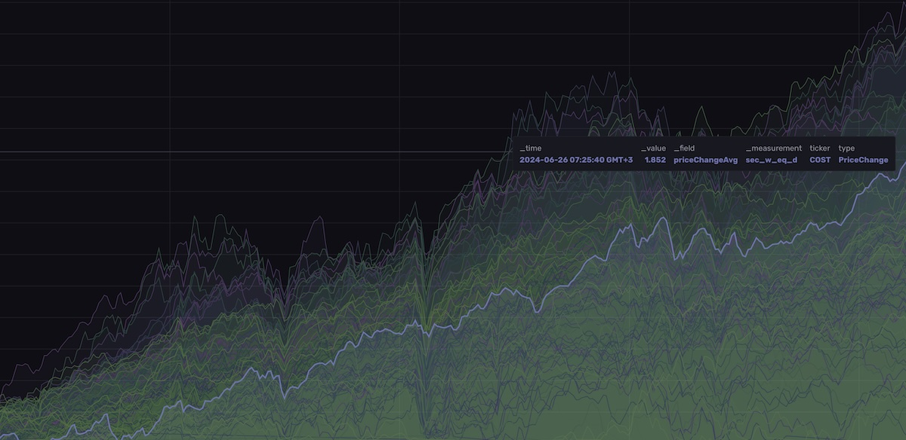

## Gather - a data fetcher

A small exercise in Kotlin, Spring Boot, InfluxDB, DynamoDB in awssdk, and Webclient.

## Fetch financials from DataJockey

Acquires [financials, both annual and quarterly](https://datajockey.io) for the same companies that we obtain market data for. This allows to make all sorts of analytics to compare price development against actual business results. The analytics is planned to be calculated in a separate service running Apache Flink.

A DataJockey free tier account allows 10 rest api requests per minute. However, as this data is expected to be static and to update only quarterly, we need not run through all the tickers frequently. Instead we fetch a small subset of the companies taken as a shuffle with uniform probability.

<p align="center">
  
</p>

According to Stirling approximation it should take about one month (~20 banking days) with hourly samples of 7 companies to shuffle through 200 tickers. There will be duplicate attempts for companies, and rightly should be as they publish new results every quarter. However, no state is required to manage the companies already fetched for.

### Fetch financials immediately for one company

A rest api server provides an admin endpoint to fetch the financials for any company by its trading ticker symbol.

## Fetch Historical prices from Alpaca

Acquires [historical bar data from Alpaca](https://docs.alpaca.markets/reference/stockbars-1) for the [n most valuable companies in the S&P 500 index](src/main/resources/source-data-params.yml). Those data are then used to compose an *equally weighted index with a daily rebalance*, whose evolution aims to mimic, though not to strictly follow, the daily features of the S&P 500. This effort potentially allows to search for [insights about trends in price development and money flows](influxdb/queries/example_queries.flux), and to discover curious patterns for possible trading signals. The service pays no attention to either dividends or brokering fees.

| From aggregated index value..               | to a breakdown of underlying development, and beyond..|
|---------------------------------------------|-------------------------------------------------------|
|  |       |

### Equally weighted index

All securities start with the same weight. Securities that are added over time will be added at an equal weight to the index value at the start of that day.

### Daily rebalance

Adjusts the weights daily to maintain equal weight distribution among securities. All securities begin each day with equal opportunity to move the index while historical gains remain mostly affected by best performers.

### Redo individual stock after Split or Merge event

The market data will be fetched with an option that adjusts all stock event effects into the prices, which makes all pries comparable over the entire period. Wait for a banking day or two for internal processes at Alpaca to have taken the stock event into account. Then delete the price data for that ticker from just before the event and the system will reftch the bar data with adjusted prices and recompute its effects on the index.

```
docker exec -it influxdb bash

influx delete --org <organisation> \
  --bucket <bucket> \
  --start <one full day before split event> \
  --stop '2099-12-31T23:59:59Z' \
  --predicate '_measurement="sec_raw_30mi" AND ticker=<ticker>' \
  --token <token>
```
