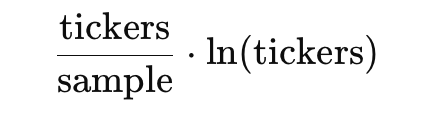
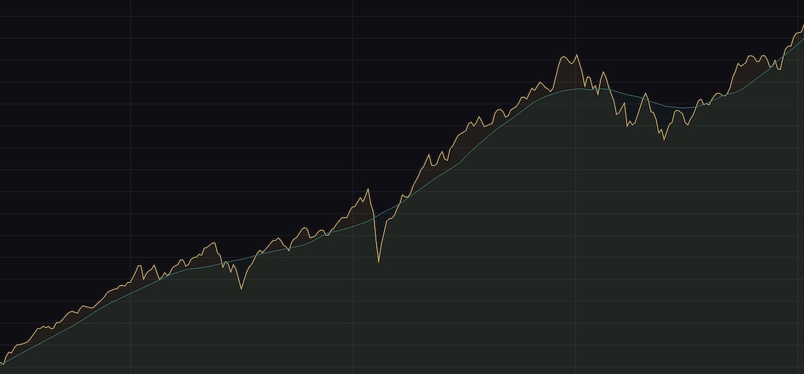
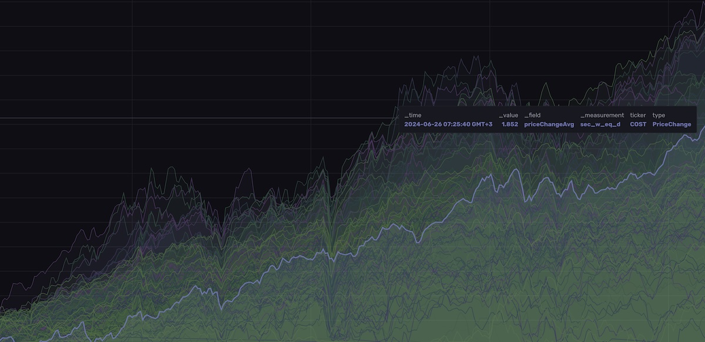

## Gather - a data fetcher

A small exercise in Kotlin, Spring Boot, InfluxDB, DynamoDB in awssdk, and Webclient.

## Economical Indicators from Fred

[Fred](https://fred.stlouisfed.org/) provides a large collection of economical indicators. For now it is used as a source for VIX - the Volatility Index by Chicago Board Options Exchange.

## Financials from DataJockey (appears that the services was discontinued)

Acquires [financials, both annual and quarterly](https://datajockey.io) for the same companies that we obtain market data for. This allows to make all sorts of analytics to compare price development against actual business results. The analytics is planned to be calculated in a separate service running Apache Flink.

A DataJockey free tier account allows 10 rest api requests per minute. However, as this data is expected to be static and to update only quarterly, we need not run through all the tickers frequently. Instead we fetch a small subset of the companies taken as a shuffle with uniform probability.

<p align="center">
  
</p>

According to Stirling approximation it should take about one month (~20 banking days) with hourly samples of 7 companies to shuffle through 200 tickers. There will be duplicate attempts for companies, and rightly should be as they publish new results every quarter. However, no state is required to manage the companies already fetched for.

### Fetch financials immediately for one company

A rest api server provides an admin endpoint to fetch the financials for any company by its trading ticker symbol.

## Historical prices from Alpaca

Acquires [historical bar data from Alpaca](https://docs.alpaca.markets/reference/stockbars-1) for the [n most valuable companies in the S&P 500 index](src/main/resources/source-data-params.yml).

## Calculate a synthetix index to mimic the S&P 500

Calculate an *equally weighted index with a daily rebalance* to loosely mimic the S&P 500 index. This effort potentially allows to search for [insights about trends in price development and money flows](influxdb/queries/example_queries.flux), and to discover curious patterns for possible trading signals.

...
- Resolution is 1 (one) bank day
- Each ticker gets an equal weight and all weights are rebalanced every day
- The calculation pays no attention to either dividends or brokering fees that would occur of trading and holding those shares.

| From aggregated index value..               | to a breakdown of underlying development, and beyond..|
|---------------------------------------------|-------------------------------------------------------|
|  |       |

### Equally weighted index

All securities start with the same weight. Securities that are added over time will be added at an equal weight to the index value at the start of that day.

### Daily rebalance

Adjusts the weights daily to maintain equal weight distribution among securities. All securities begin each day with equal opportunity to move the index while historical gains remain mostly affected by best performers.

### Maintaining the list of companies

Ideally we would run eithe a somewhat stable subset of n out of S&P 500 but still evolving within some parameters or we would include the full set of S&P 500.
See [fja05680/sp500](https://github.com/fja05680/sp500/tree/master) for one approach.

### Recovering after stock event

Splits and merges will immediately change the quotations of their shares with the same multiple as the stock event took place. This service fetches historical prices as adjusted to those historical events.

- let a few days pass so that Alpaca internal operations has time to reflect the stock event into historical prices
- delete entire entries from db using command below
- the next round(s) of automatical fetching and index processing will settle the stock event effcts into that sewcurity and the entire index

Delete query
```
curl --request POST \
  "$INFLUX_URL/api/v2/delete?org=$ORG&bucket=stream-lines-market-data-historical" \
  --header "Authorization: Token $INFLUX_TOKEN" \
  --header "Content-Type: application/json" \
  --data '{
    "start": "2016-01-01T00:00:00Z",
    "stop": "2099-12-31T00:00:00Z",
    "predicate": "_measurement=\"<securities-...-raw>\" AND ticker=\"<ticker>\""
  }'
```

### Recovering after ticker rename

1. Materialize new entries with the new ticker symbol for all securities-daily-change-... -measurements
```
curl --request POST \
  "$INFLUX_URL/api/v2/query?org=$ORG" \
  --header "Authorization: Token $INFLUX_TOKEN" \
  --header "Content-Type: application/vnd.flux" \
  --data-binary '
from(bucket: "stream-lines-market-data-historical")
  |> range(
    start: 2016-01-01T00:00:00Z,
    stop: 2099-12-31T00:00:00Z
  )
  |> filter(fn: (r) =>
    r._measurement == "<measurement>" and
    r.ticker == "<old ticker>"
  )
  |> map(fn: (r) => ({r with ticker: "<new ticker>"}))
  |> to(bucket: "stream-lines-market-data-historical")
'
```

2. Query for the new values, eg in Influxdb Data Explorer

3. Delete entries of the old ticker symbol form all securities-daily-change-... -measurements
```
curl --request POST \
  "$INFLUX_URL/api/v2/delete?org=$ORG&bucket=stream-lines-market-data-historical" \
  --header "Authorization: Token $INFLUX_TOKEN" \
  --header "Content-Type: application/json" \
  --data '{
    "start": "2016-01-01T00:00:00Z",
    "stop": "2099-12-31T00:00:00Z",
    "predicate": "_measurement=\"<measurement>\" AND ticker=\"<old ticker>\""
  }'
```
