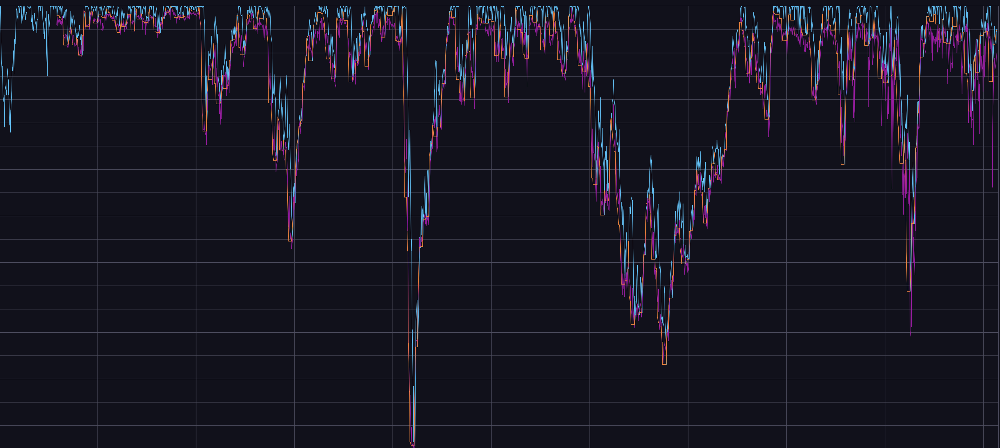

# Narwhal

Narwhals are [a sea species](https://en.wikipedia.org/wiki/Narwhal) remarkably well adapted to sense themselves around in the waters

## Features 

Narwhal is a small service in python with brief exposure on xgboost and numpy to
- Collect and submit training data for AWS Sagemaker
- Use that model to run predictions

We have chosen XGBoost (Extreme Gradient Boosting) as the machine learning algorithm for these qualities:
- Fast training and prediction
- Reasonability
- Works particularly well for financial data, which is often continuous, 'foggy', and of wide range of magnitudes.

The data is collected from after a grace period (6-12 months) since beginning of historical trading data acquired by [Gather service](https://github.com/anzo-p/stream-lines/tree/main/gather) up to about 1.5 years in the past form today.
- Initial 6-12 months are omitted for various long running aggregates such as moving averages to establish 
- Tail 1.5 years are omitted in order to deny model creator to learn over 'recent data' thus forcing true prediction over that period.

Both the _training data_ (orange line) and the _prediction_ (purple line) are then stored into influxdb where they can be compared against the _actual drawdown_ (blue line) for a visual validation and inspection of the results. In the image below the training data spans 1 Aug 2016 - 20 Aug 2024, during which the prediction expectably follows the training data 'well' - this is the data the model creation has 'seen' and generalized over. From thereon the prediction necessarily starts to deviate from what would be the training data because these are data that the model creation has not 'seen'. Is that predicted stock market drawdown then 'right' to some useful degree? And so my curiosity was piqued..




## Interacting with the service

...while schema still in early development (ie. no time to wait for periodical cronjob)

```
brew install --cask session-manager-plugin

aws ecs list-tasks \
  --cluster <cluster-arn> \
  --service <service-arn> \
  
aws ecs execute-command \
  --cluster <cluster-arn> \
  --task <task-id> \
  --container NarwhalContainer \
  --interactive \
  --command "/bin/sh"

curl localhost:8000/health
curl -o /dev/null -s -w "%{http_code}\n" -X POST http://localhost:8000/train
curl -o /dev/null -s -w "%{http_code}\n" -X POST http://localhost:8000/predict?model-id=<model-id>
```
