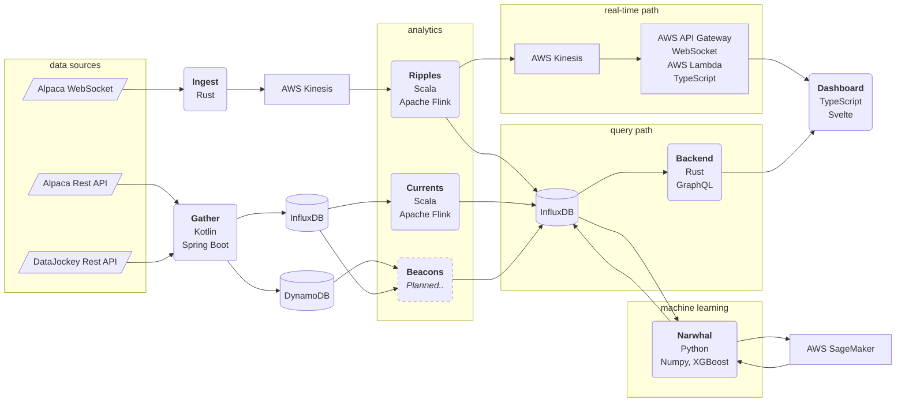

## Stream Lines

The App literally draws an SVG Polyline onto a dashboard out of a stream of data consumed from a websocket, processed in a Flink DataStream, and then streamed onto that dashboard in a Web App. AWS infra included. Polyglot by choice.

### Ingest

Consumes a websocket from an external provider. In this case market data feed from [Alpaca](https://alpaca.markets/data). This data is cached internally onto Kinesis from where it can be processed by data stream processing jobs.

### Gather

Consumes rest api from an external provider. Currently bar data for historical transactions from Alpaca.

### Ripples

Compute any interesting values ot of the data stream provided by Ingest. These could quickly and easily become many DataStreams and even Flink Apps that feed input to each others to do further, deeper computations.

Importantly Ripples ouputs into two paths:

- InxfluxDB - for diagrams to initialize themselves upon queries
- Downstream Kinesis - for updates to diagrams without having to re-fetch full dataset.

### Currents

Compute analytical results out of data provided by Gather.

### Beacons (planned service)

Becons would compute analytical results from company financials themselves and also from interesting relationships between fundamentals and stock price development.

### Narwhal

Narwhal commposes learning data for AWS Sagemaker to calculate a model using XGBoost and then uses that model to run predictions.

### Backend

A GraphQL server to provide data from InfluxDB.

### Dashboard

Draw SVG Polylines form the data as well as ruler guides to that data. Some amount of data normalising required.
